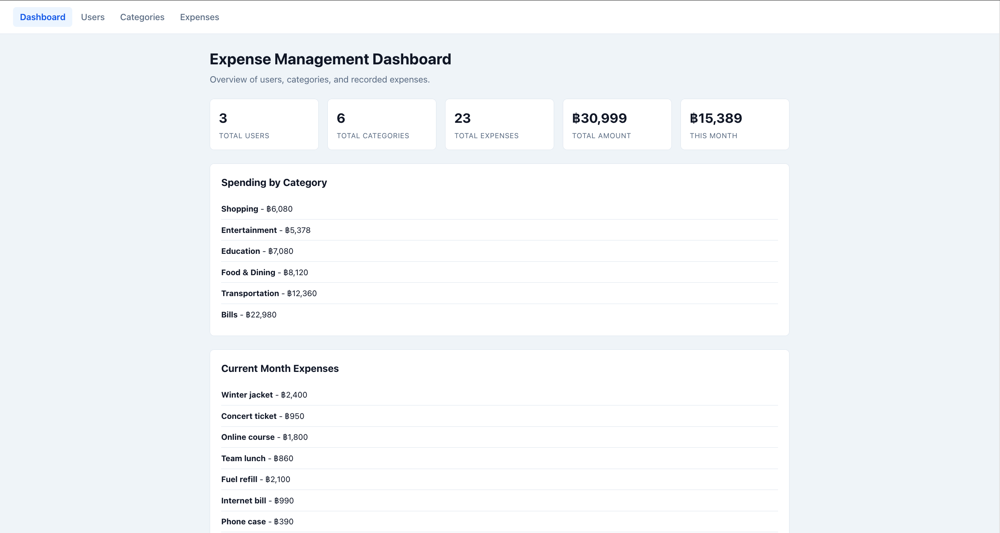
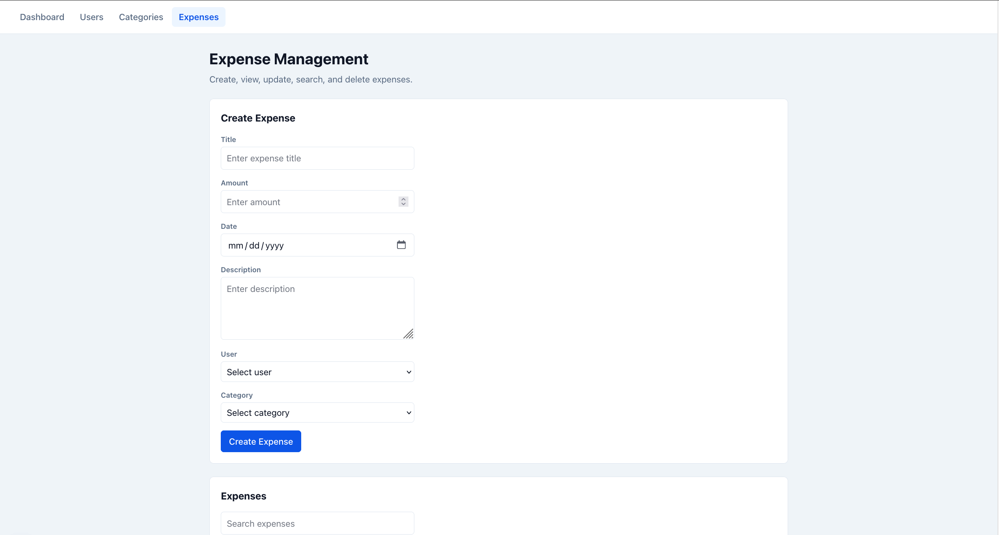
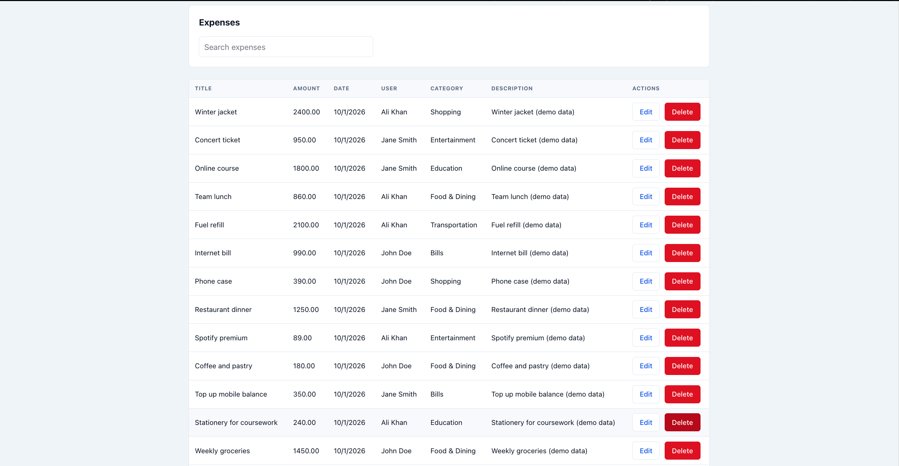

# ExpenseTrack — Personal Expense Management System

A full-stack expense tracking application built with Next.js and MongoDB. Users can
record expenses against categories, and a dashboard summarises spending across
totals, the current month, and per-category breakdowns.

<!-- Replace the two lines below with real screenshots once captured -->





## Team

| Name | Student ID | Repository |
| --- | --- | --- |
| Okkar Kaung Myat | 6632104 | [github.com/okkar-km/expense-track](https://github.com/okkar-km/expense-track) |

## Features

- **Dashboard** — total expenses, current-month spend, spending by category, current
  month expenses, and recent activity
- **User management** — create, view, update, and delete users
- **Category management** — create, view, update, and delete categories
- **Expense management** — create, view, update, and delete expenses, linked to both a
  user and a category, with search and filtering
- **Referential integrity** — deleting a user or category that still has expenses is
  rejected rather than silently orphaning records
- **Password exclusion** — API responses never include user passwords
- **Seed data** — a script populates the database with realistic demo records

## Tech Stack

| Layer | Technology |
| --- | --- |
| Framework | Next.js 16 (App Router) |
| UI | React 19, TypeScript 5 |
| Styling | Plain CSS |
| Database | MongoDB 8 + Mongoose 9 |
| Reverse proxy | Nginx |
| Runtime | Node.js |

## Getting Started

### Prerequisites

- Node.js 20 or later
- MongoDB running locally

### Installation

```bash
npm install
```

Create a `.env.local` file in the project root:

```bash
MONGODB_URI=mongodb://127.0.0.1:27017/expense_track
```

Load demo data (optional but recommended):

```bash
npm run seed
```

Start the development server:

```bash
npm run dev
```

Open [http://localhost:3000](http://localhost:3000). Visiting `/` redirects to `/dashboard`.

### Scripts

| Command | Description |
| --- | --- |
| `npm run dev` | Start the development server |
| `npm run build` | Create a production build |
| `npm start` | Serve the production build |
| `npm run lint` | Run ESLint |
| `npm run seed` | Clear and repopulate demo data |

## API Reference

All endpoints return JSON. Every route accepts and responds with standard HTTP status codes.

### Users

| Method | Endpoint | Description |
| --- | --- | --- |
| `GET` | `/api/users` | List all users |
| `POST` | `/api/users` | Create a user |
| `GET` | `/api/users/:id` | Get one user |
| `PATCH` | `/api/users/:id` | Update a user |
| `DELETE` | `/api/users/:id` | Delete a user |

### Categories

| Method | Endpoint | Description |
| --- | --- | --- |
| `GET` | `/api/categories` | List all categories |
| `POST` | `/api/categories` | Create a category |
| `GET` | `/api/categories/:id` | Get one category |
| `PATCH` | `/api/categories/:id` | Update a category |
| `DELETE` | `/api/categories/:id` | Delete a category |

### Expenses

| Method | Endpoint | Description |
| --- | --- | --- |
| `GET` | `/api/expenses` | List expenses, with optional filtering |
| `POST` | `/api/expenses` | Create an expense |
| `GET` | `/api/expenses/:id` | Get one expense |
| `PATCH` | `/api/expenses/:id` | Update an expense |
| `DELETE` | `/api/expenses/:id` | Delete an expense |

`GET /api/expenses` accepts the query parameters `search`, `categoryId`, `userId`,
`startDate`, and `endDate`. User and category references are populated in responses.

### Example

```bash
curl -X POST http://localhost:3000/api/categories \
  -H "Content-Type: application/json" \
  -d '{"name": "Food & Dining", "description": "Groceries and restaurants"}'
```

## Project Structure

```
src/
├── app/
│   ├── api/            Route handlers (backend)
│   ├── categories/     Category CRUD page
│   ├── dashboard/       Dashboard page
│   ├── expenses/       Expense CRUD page
│   ├── users/          User CRUD page
│   ├── globals.css     Global styles
│   ├── layout.tsx      Root layout
│   └── page.ts         Redirects / to /dashboard
├── components/         Navbar
├── lib/                MongoDB connection helper
├── models/             Mongoose schemas (User, Category, Expense)
├── types/              Shared TypeScript interfaces
└── utils/              Error message helper
scripts/seed.mjs        Demo data seeder
```

## Data Model

- **User** — name, email (unique), password
- **Category** — name (unique), description
- **Expense** — title, amount, date, description, and references to a User and a
  Category

## Deployment

<!-- Add the public URL here after deploying -->

Live URL: `https://REPLACE_ME`

The application is deployed on an Azure virtual machine. Nginx terminates HTTPS and
proxies to the Next.js production server on port 3000. MongoDB runs locally on the
same machine and is reachable only over `127.0.0.1`. See `docs/DEPLOYMENT.md` for the
full setup.

## Security Notes

This is an academic prototype and does not implement authentication. Passwords are
stored in plaintext and excluded from API responses, but no login or session handling
is provided. Deploy it on a private URL only.